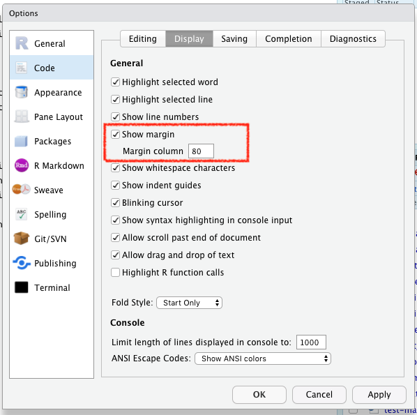
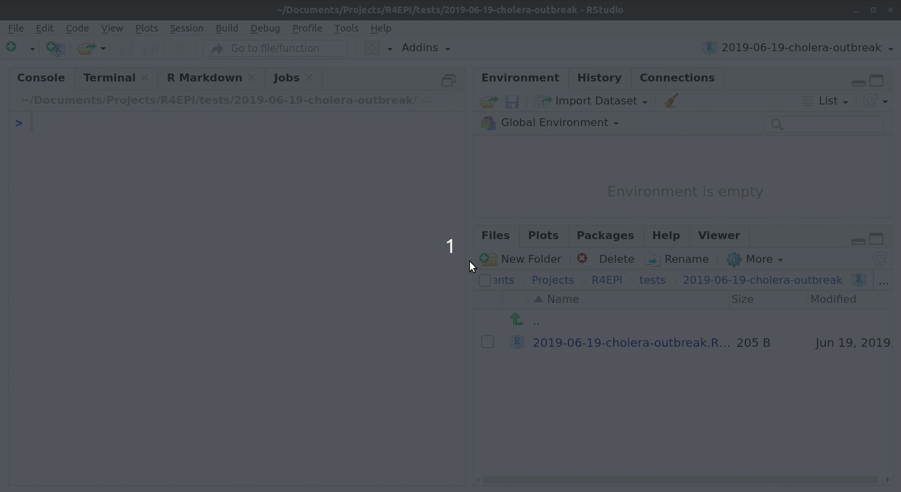

This page describes important first steps for getting started with R, RStudio, and the templates!

A step-by-step [walk-through of an outbreak template case study](https://r4epis.netlify.com/training/walk-through/case_study_overview/) is available in the Training Materials pages of this website.

## NECESSARY COMPONENTS

### R

**R is a free software for statistical computing and graphics.** The templates need at least R version 3.3. We recommend [downloading R directly from CRAN](https://cran.r-project.org), a central repository of R code, packages, and documentation. If desired, [the MRAN version of R](https://mran.microsoft.com/) will work as well.

> **Caveat if using MRAN**: MRAN is a version of R that has modifications that are outside the scope of this project, however, it should be noted that it also locks the version of all packages to a specific date, so care is needed to specify repositories when installing R packages. If you are unsure whether you have MRAN or CRAN R installed then see this [FAQ](<https://github.com/R4EPI/sitrep/wiki/4). 


### RStudio Desktop

**[RStudio](https://www.rstudio.com) is an interface for easier use of R**, and enables production of automated reports. RStudio must be downloaded separately 
and in order for it to function **you must also have R installed on the computer**.

Please have RStudio [version 1.1.463 or greater installed](https://www.rstudio.com/products/rstudio/download/#download).

There is an overview of RStudio, including comparisons to Stata, in the [Training Materials](https://r4epis.netlify.com/training/) pages. 


### Configuring RStudio

It's important to start R every time with a clean working session. To do this, you must ensure that RStudio is set up correctly. Go to <kbd> Options > Global Options </kbd> and do the following:

1. **de-select** "Restore .RData into workspace at startup". This ensures R never loads any previous workspaces
2. **Select "Never"** from the dropdown menu for "Save workspace to .RData on exit". This ensures that R will never attempt to save your workspace when you close it.

Your Global Options window should look like this:


When writing RMarkdown and code, it's common to wrap your text at 80 characters. You can add a reference line for this in RStudio:



### Setting the default R repository if using MRAN

If you are using Microsoft's version of R (MRAN), the packages are all locked to one specific date (as of this writing, it's 2018-08-07). 
If you are unsure whether you have MRAN or CRAN R installed then see the [FAQ](<https://github.com/R4EPI/sitrep/wiki/4). 

To install packages that were either created or updated after this date, you should use the RStudio cloud repository. The following code will update a file called `.Rprofile` that lives in your home directory (on Windows, this directory is usually "C:\Users\\\<username>").

To create this file and set your default repository, open R and type:

```r
## install.packages("usethis", repos = "https://cran.rstudio.com/")
library("usethis")
edit_r_profile()
```

An editor window will open up and instructions will be printed to your R console. Paste the following code in the editor, save it, and restart your R session:

```r
local({
  r <- getOption("repos")
  r["CRAN"] <- "https://cran.rstudio.com/"
  options(repos = r)
})
```

This sets the default repository to be https://cran.rstudio.com so that you will always have the latest version of R packages available.


### Updating your R version 

**Please make sure you have the latest version of R installed.** 
To do this you can use the *installr* package. 
See [this page](https://www.r-statistics.com/tag/installr/) for details. 

For MSF Field Epidemiologists, you do not have full admin rights to be able to do this on your field laptops. Please liaise with someone in your headquarters to ask what the best way is to do this.

``` r
install.packages("installr") # install package
installr::updateR() # updating R.
## If you wish it to go faster, run: installr::updateR(TRUE)
```

### Installing the **sitrep** package 

The **sitrep** package, developed by MSF and partners, is stored on the website GitHub. Therefore, the procedure to install is different than for most packages you will work with. 

To install **sitrep** from GitHub you must first install the **remotes** package. 

``` r
install.packages("remotes", repos = "https://cran.rstudio.com")
```

Once **remotes** is installed, use its *install_github* function to install **sitrep** from the appropriate repository on GitHub. 
This command below will install the **sitrep** package and also install any packages necessary for use of the templates that are not currently installed on your machine.

*It will not, however, update any packages already installed. If you want it to update packages, then you should change the last argument to `update = "ask"`.*

```r
remotes::install_github("R4EPI/sitrep", repos = "https://cran.rstudio.com", update = "never")
```
 
If you are getting errors, check the [FAQ section](<https://github.com/R4EPI/sitrep/wiki/4) of the **sitrep** wiki. 

### Opening the templates

**The outbreak and survey report templates are special scripts called "R-Markdowns"**, and are included with **sitrep** package installation. You can open and modify them to create customized automated reports. 
Read more about RMarkdown scripts and how to modify the templates in [Training Materials](https://r4epis.netlify.com/training/) pages of this website. 



To access the templates:

* Go into Rstudio
* Under the 'File' button (top left of your screen), click on the "+" 
* Then click on "R markdown...", 
* and select "From template"; 
you should be able to see all the options of templates that are available. For example "Outbreak Report". 

If you are not seeing these, then please take a look at this [GitHub post](https://github.com/R4EPI/sitrep/issues/35). 

### Folder structure 

It is *strongly* advised that you save your RMarkdown template and any related data within the same folder - specifically within a *R Project*.
Read more about working within R Projects in the R Basics section of the Training Materials pages.


## NICE-TO-HAVE COMPONENTS

#### Tools for building packages

Most packages will have windows binaries available for installation. For those that don't, [the RTools suite](https://cran.r-project.org/bin/windows/Rtools/) is a straightforward, easy-to-install (with administrator priviledges) toolset that gives the user the ability to compile and install R packages directly from source on windows machines. 

