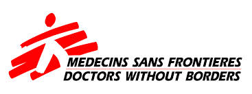

  

# R4epis - what is it?

R4epis is a project for the development of the package **sitrep** in R software. The idea of the package is give you standardised data cleaning, analysis and
reporting tools to cover common types of outbreaks and population based surveys
that would be conducted in an MSF emergency response setting. The templates
cover outbreak investigations (acute jaundice syndrome, cholera, measles,
meningitis) and three of the MSF ERB pre-approved surveys: mortality, nutrition
and vaccination.

All of the templates are contained within the package as RStudio templates that
can easily be used from within RStudio. The user then changes the
version of the template and modifies it to his/her needs.

The templates address all aspects of:

* data cleaning of outbreak linelists and survey data (household and individual
  level)
* analysis of data to report in terms of time/place/person (more for linelist
  analysis)
* analysis of survey data (including accounting for survey design)

All coding is open source and freely available and can be used by anyone.

For suggestions on what to add or change, please linke to our Github location.
**TODO** add link to Github location or linke with contribution?

# Who funded R4epis?

R4epis was funded through the [Sapling Nursery](https://www.msf.org.uk/sapling-nursery-grow-your-ideas), an MSF internal innovation fund for new projects that aim to improve the medical care MSF provides. 

# Who contributed to R4epis

R4epis has been a collaboration between the R for Epidemics Consortium ([RECON](https://www.repidemicsconsortium.org/)) and MSF. 

The project has merged the skills and experience of people in [coding in R software](https://blogs.msf.org/bloggers/r4epis-team/r4epis-hackathon), [field epidemiology](https://blogs.msf.org/bloggers/larissa/innovation-introducing-r4epis), spatial epidemiology, health information systems and public health.

**TODO** Add link to list of contributors

# How does the website work

**TODO** insert structure and links of the website

